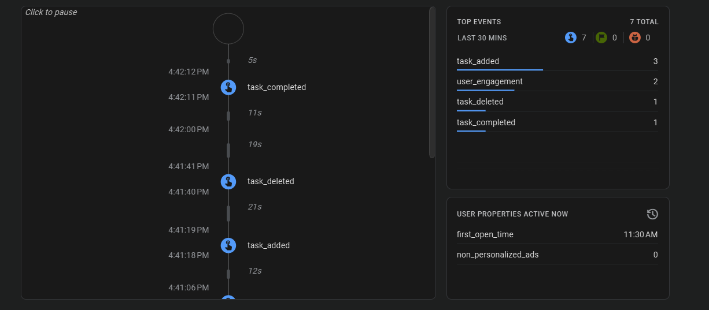
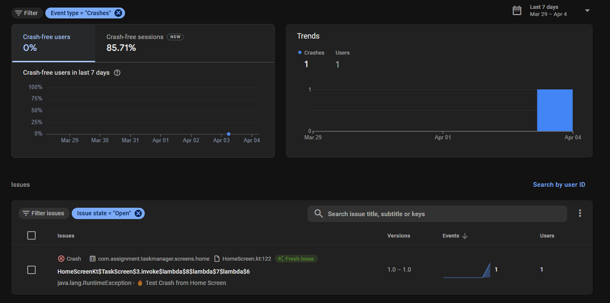
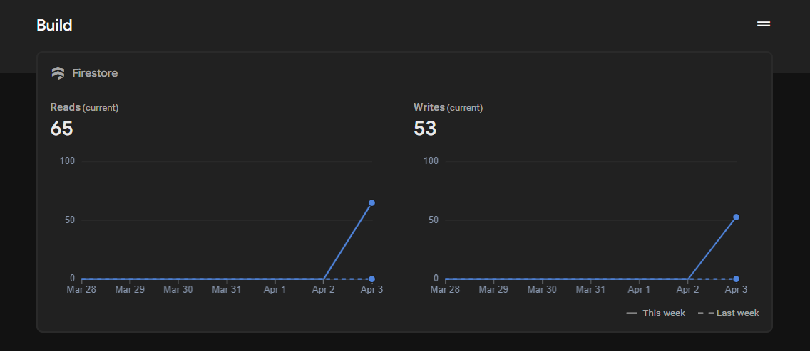
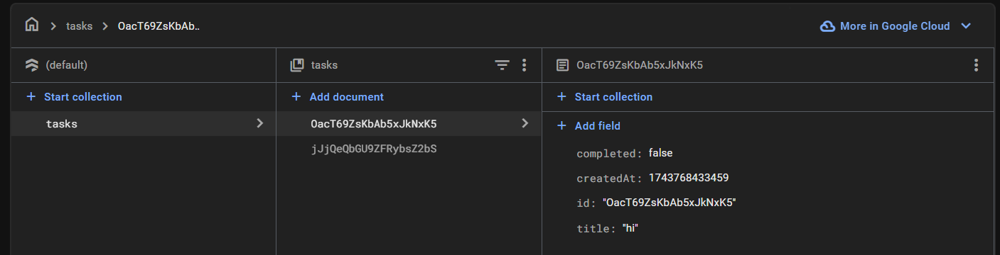
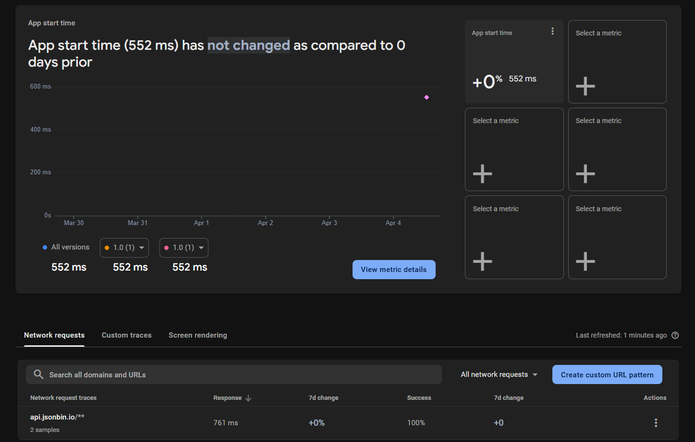

# 📌 Task Manager App  

🚀 **An Android app for task management**, integrating **Firestore, Room Database, Retrofit, Firebase Analytics & Crashlytics**, built using **MVVM and Jetpack Compose**.  

---

## 📂 Tech Stack  
- **Kotlin + Jetpack Compose** (UI)  
- **Room Database** (Local Storage)  
- **Firebase Firestore** (Cloud Sync)  
- **Retrofit + JSONBin** (API Integration)  
- **Firebase Analytics & Crashlytics** (Monitoring)  
- **Hilt** (Dependency Injection)  

---

## 📌 Features Implemented  

### ✅ **API Integration (Retrofit & JSONBin)**  
- Fetched **motivational and technical tips** using JSONBin API.  
- Endpoint: [https://api.jsonbin.io/v3/b/66f5687ce41b4d34e43839b0?meta=false](https://api.jsonbin.io/v3/b/66f5687ce41b4d34e43839b0?meta=false)  

### ✅ **Task Management (Firestore & Room)**  
- Tasks stored in **Firestore** and synced locally using **Room Database**.  
- Users can **add, edit, delete**, and **mark tasks as completed**.  

### ✅ **Firebase Analytics & Crashlytics**  
- Logged key events: **"Task Added," "Task Edited," "Task Completed."**  
- Implemented **manual and database error crashes** for Firebase Crashlytics tracking.  
- Monitored **network performance** using Firebase.  

---

## 🚀 Setup Instructions  

1️⃣ **Clone the Repository**  
git clone https://github.com/Yuvaraj-Rathod/TaskManagerApp.git
cd TaskManagerApp

2️⃣ **Open in Android Studio**  
- Open the project in **Android Studio** (latest stable version).  

3️⃣ **Configure Firebase**  
- Add **google-services.json** to the `app/` directory.  
- Enable **Firestore, Analytics, and Crashlytics** in the Firebase console.  

4️⃣ **Build & Run** ▶️  
- Sync Gradle and run the app on a real device or emulator.  

---
## 📌 Application UI and Working Demo
- 🚀 **App Video Demonstration Video:** [DropBox_Link](https://www.dropbox.com/scl/fi/bmo5jujj9gw6kq1srhjil/VN20250404_174730.mp4?rlkey=8chdnmsf4ezw4j5dykedfsamu&st=kwaqjkbl&dl=0) 

## 📸 Screenshots & Video  

📸 **Firebase Analytics Events**  

📸 **Crashlytics Console (Forced Crash Test)**  

📸 **Network Performance Monitoring**  

📸 **Firestore Entries**  

📹 **App performance**  

---

## 🔗 Links  

- 📂 **GitHub Repository:** [Yuvaraj-Rathod/TaskManagerApp](https://github.com/Yuvaraj-Rathod/Assignment_TaskManager)
- 🔥 **JSONBin API Endpoint:** [Click Here](https://api.jsonbin.io/v3/b/66f5687ce41b4d34e43839b0?meta=false)

